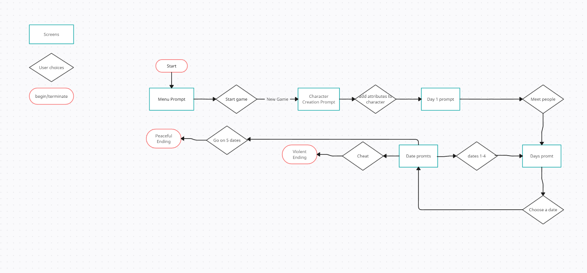
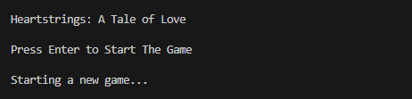
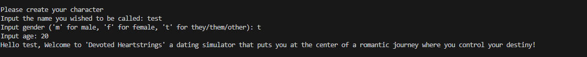
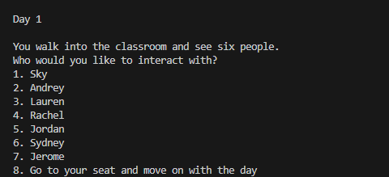
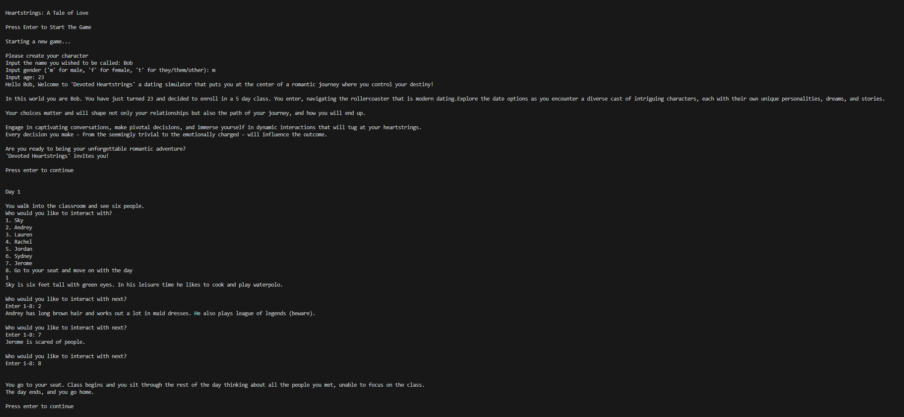
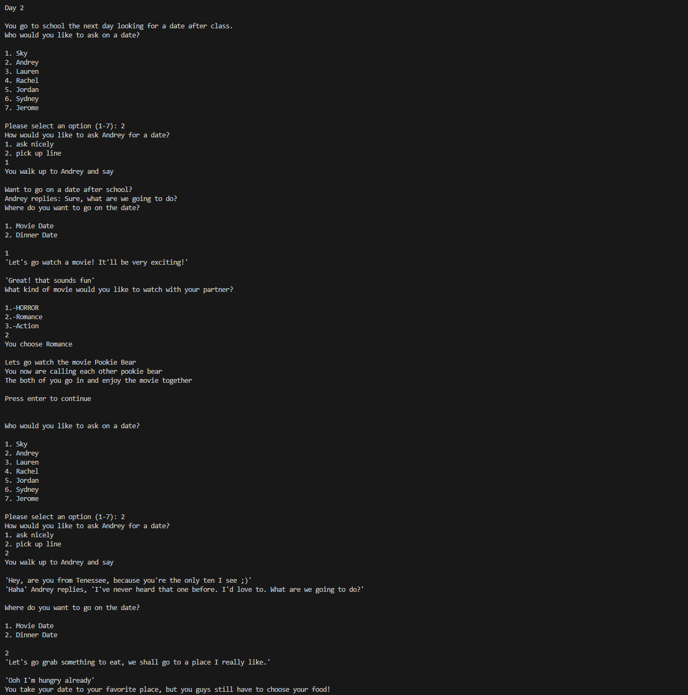
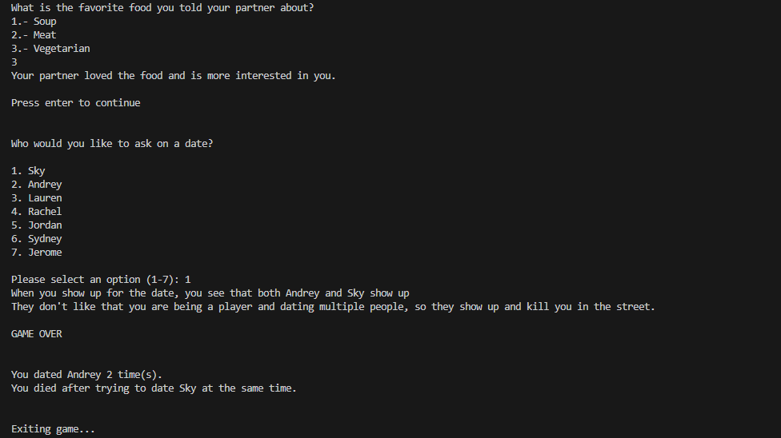
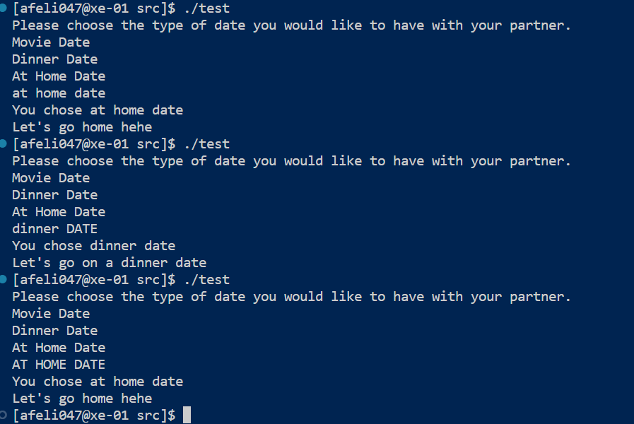

# CS100 Project: Text based RPG
 
 Authors: Andrey Felix (https://github.com/ElAndreu),     Clement Chen (https://github.com/cchen606),     Jerome Guan (https://github.com/jguan11),     Gillian Ong (https://github.com/gillian-ong)
 
## Project Description

 When presented with the opportunity to create a coding assignment for this class, we started thinking what project we could tackle, and what we wanted to do. Most of us are interested in video games, so we decided why not create a game? It will allow us to learn how to code more efficiently and use the terminal better as it will be a terminal text based game. We think this will be  a good coding challenge for us since it will be a choice based game that will have divergent routes depending on the choices made, and we will have to create a network of possibilities that runs with bugs, as well as write out a story progression to accompany it so it is not a strict hard coding job. 

 In terms of the tools we will use, we plan to only use the C++ programming language since it is the language we are most familiar with. We will all be using VSCode as our text editor to support and help each other whenever we have a problem. That way we can all succeed in working efficiently on this project. The output of this program will be a story, and prompts to the user about how they would like to interact with the game. The input would be the response to these prompts, and would allow the user to interact with the game, and perform actions/commands. The project provides a multitude of features that round out the game experiences. One major feature we want to include is to have regions for the user to explore. We would also have other features different characters, unique NPCs and the like. 
 

## User Interface Specification
Here are some diagrams to show how our game will be structred, and how it will look. 

### Navigation Diagram

### Screen Layouts
Because our game is a terminal confined text based rpg, the screen layout will just be text output from the terminal. The player will be prompted with a menu screen and will select options based on the output. 

Menu Prompt Screen Layout: 

Character Creation Screen Layout

Gameplay Screen Layout

## Class Diagram

 
 

We edited the Class Diagram to better follow SOLID principles, and just to be more accurate to our plan. 

We increased the amount of classes including, the main character class, character class, and different date classes. We applied the Single-Responsibility Principle by seperating classes into more specific roles making sure that all these classes only had one job. 

The addition of the three different date classes follow the Open-Closed-Principle as they all extend on the date class. 

We followed the Interface Segregation Principle while thinking up the classes we would use, making sure not to add uneeded functions that would not be used in classes. We focused on this specifically when doing the three date classes, making sure the date class didn't apply anything uneeded. 

 >   * For each update in your class diagram, you must explain in 3-4 sentences:
 >     * What SOLID principle(s) did you apply?
 >     * How did you apply it? i.e. describe the change.
 >     * How did this change help you write better code?
 
 > ## Final deliverable

 
 ## Screenshots
 
 Input/Output Example 1

 

 Input/Output Example 2

 

  Input/Output Example 3

 
 ## Installation/Usage

In order to run the application, first download the game file. Once you have the file, open your terminal, and run these three commands. "cmake .", "make", "./runGame". This will create and run the executable "runGame". To play again, simply run the executable again with "./runGame". 
    
 ## Testing

 In order to make the Dates work, we had implemented some testing to see if the functions would get called with each other once they would be put into functions, and interact with each other and other classes, it is safe to say that during this testing it was able to call the functions.
 

 
